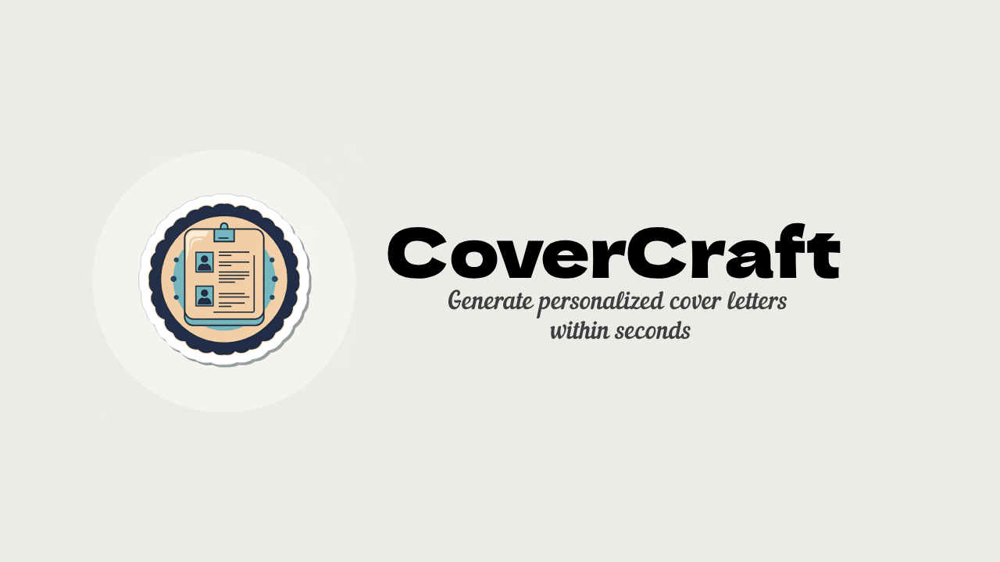

# CoverCraft

CoverCraft is an AI-driven tool that generates personalized cover letters in seconds, using the power of Gemini to craft professional, tailored documents, and export them in .doc format for easy customization.



## Tech Stack

All code is written in Python using Flask

## Installation

Install Flask,its dependencies and additional packages

1 -> Create a Python env

```bash
  python3 -m venv env
  source ./env/bin/activate
```

2 -> Install dependencies

```bash
pip install -r requirements.txt
```

3 -> Run app

```bash
python app.py or python3 app.py
```

## Environment Variables

To run this project, you will need to gert Gemini API key and then add it to the .env file

`API_KEY`

## Lessons Learned

I wanted to make a cover letter that would be personalized and meet a high standard, so I used prompt chaining to craft the first paragraph, which I saw as the most important part of the cover letter, and then generated the body based on that. The project was created because, during a job search, people often need to apply to hundreds of positions quickly, and writing a new cover letter each time is incredibly time-consuming. I built this project to save time while maintaining the quality and professionalism of each cover letter.

One of the main challenges I faced was ensuring that the generated content was both relevant and personalized for different job applications. To overcome this, I fine-tuned the prompts and logic in Gemini to understand specific job descriptions and user inputs better, ensuring that the output remained high-quality and tailored.
